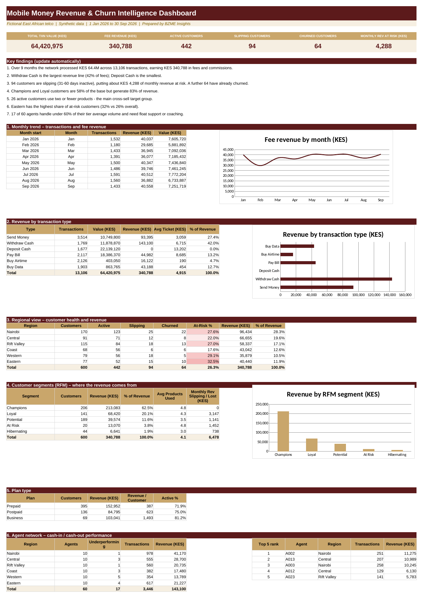

# Mobile Money Revenue & Churn Intelligence
**Sector:** Telecom  |  **Tool:** Excel  |  **Data:** synthetic

> All data in this project is synthetic and generated for demonstration. Fee rates, targets and thresholds are illustrative.

## Dashboard preview

## Business question
Which mobile money customers drive revenue, which are drifting toward churn, and which agents are not performing?

## Data
600 customers, 60 agents and about 13,100 transactions (Jan to Sep 2026).

## What I built
- Fee revenue model with a configurable fee schedule
- Customer status (Active, Slipping, Churned) from days since last transaction
- RFM segmentation (Champions, Loyal, Potential, At Risk, Hibernating)
- Cross-sell flag and agent benchmarking against tier averages

## Key results (from the workbook)
- KES 64.4M processed; KES 340,788 in fee revenue
- Champions and Loyal customers are 58% of customers but 83% of revenue
- 94 customers slipping (about KES 4,288 of monthly revenue at risk); 64 churned
- Eastern region has the highest at-risk share (32% vs 26% overall)
- 17 of 60 agents underperform against their tier

## Skills shown
Excel (SUMIFS, COUNTIFS, INDEX/MATCH, MAXIFS, PERCENTILE), RFM, dashboard design

## Files
- [Telecom_Mobile_Money_Portfolio.xlsx](Telecom_Mobile_Money_Portfolio.xlsx): the Excel workbook (open it and change the **Assumptions** sheet to see the dashboard update)
- [docs/BZME_01_Telecom_Mobile_Money_Project_Guide.docx](docs/BZME_01_Telecom_Mobile_Money_Project_Guide.docx): project write-up explaining how it works

## How to explore
1. Download the workbook and open the **Dashboard** sheet.
2. Open **Assumptions**, change one value, and watch the dashboard update.
3. Click any dashboard number and trace it back through the calculation sheet to the raw data.

---
Built by Madikizelah (Maddie) Nduta | BZME Insights | Maddiekangeti@gmail.com | LinkedIn www.linkedin.com/in/maddie-nduta
