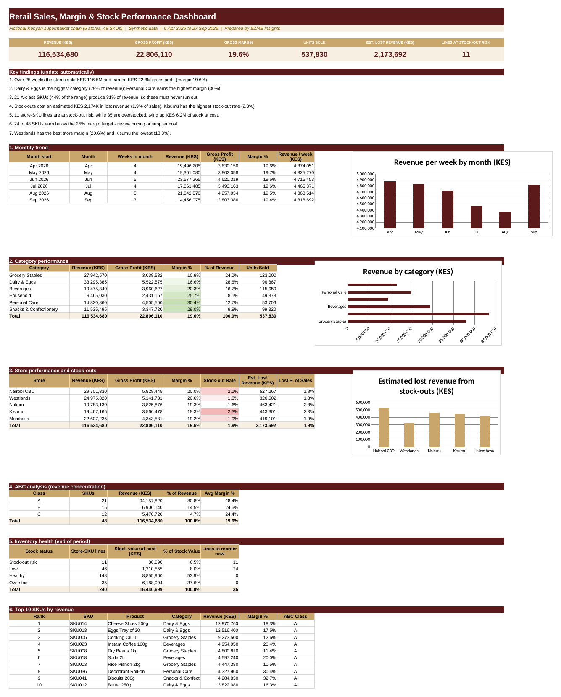

# Retail Sales, Margin & Stock Performance
**Sector:** Retail / FMCG  |  **Tool:** Excel  |  **Data:** synthetic

> All data in this project is synthetic and generated for demonstration. Fee rates, targets and thresholds are illustrative.

## Dashboard preview

## Business question
Where does profit come from, where do stock-outs lose sales, and where is cash trapped in slow stock?

## Data
5 stores, 48 SKUs, 6,000 weekly sales records (25 weeks) and 240 inventory lines.

## What I built
- Revenue, COGS (with store shrinkage) and gross profit by formula
- Estimated lost revenue from stock-outs
- ABC analysis of SKUs by revenue
- Weeks-of-cover stock status, reorder flags and margin-target check

## Key results (from the workbook)
- KES 116.5M revenue and KES 22.8M gross profit (19.6% margin)
- 21 A-class SKUs (44% of the range) generate 81% of revenue
- Stock-outs cost an estimated KES 2.2M (1.9% of sales)
- 35 overstocked lines tie up KES 6.2M of stock at cost
- 24 of 48 SKUs earn below the 25% margin target

## Skills shown
Excel (SUMIFS, INDEX/MATCH, RANK, conditional logic), ABC analysis, inventory analytics

## Files
- [Retail_Sales_Stock_Performance_Portfolio.xlsx](Retail_Sales_Stock_Performance_Portfolio.xlsx): the Excel workbook (open it and change the **Assumptions** sheet to see the dashboard update)
- [docs/BZME_02_Retail_Sales_Stock_Project_Guide.docx](docs/BZME_02_Retail_Sales_Stock_Project_Guide.docx): project write-up explaining how it works

## How to explore
1. Download the workbook and open the **Dashboard** sheet.
2. Open **Assumptions**, change one value, and watch the dashboard update.
3. Click any dashboard number and trace it back through the calculation sheet to the raw data.

---
Built by Madikizelah (Maddie) Nduta | BZME Insights | [LinkedIn]([your LinkedIn URL])
