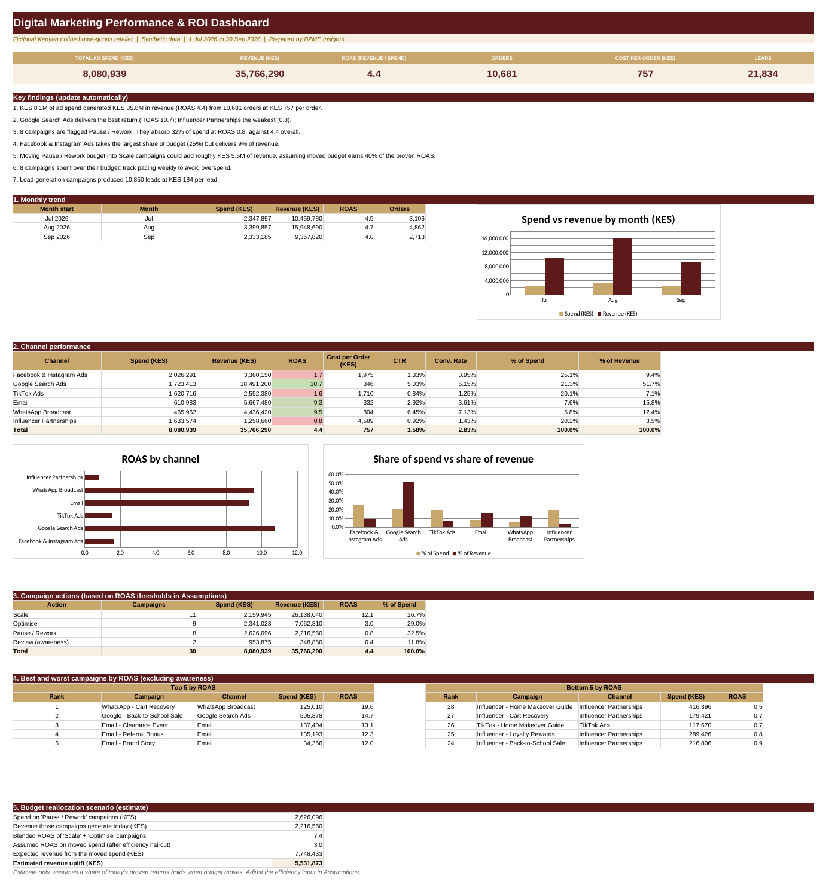

# Digital Marketing Performance & ROI
**Sector:** Marketing / E-commerce  |  **Tool:** Excel  |  **Data:** synthetic

> All data in this project is synthetic and generated for demonstration. Fee rates, targets and thresholds are illustrative.

## Dashboard preview

## Business question
Which channels and campaigns earn their budget, which should be scaled, fixed or stopped, and what could moving budget add?

## Data
30 campaigns across 6 channels and about 1,300 campaign-day records (Jul to Sep 2026).

## What I built
- Campaign scorecard: CTR, cost per click, lead and order, conversion rate, ROAS, budget used
- Automatic Scale / Optimise / Pause action based on ROAS thresholds
- Channel comparison and best/worst campaigns
- Cautious budget-reallocation scenario

## Key results (from the workbook)
- KES 8.1M spend produced KES 35.8M revenue (ROAS 4.4) from 10,681 orders
- Google Search Ads ROAS 10.7; Influencer Partnerships 0.8
- Facebook and Instagram take 25% of spend but deliver 9% of revenue
- 8 campaigns flagged Pause / Rework absorb 32% of spend at ROAS 0.8
- Reallocation estimate: about KES 5.5M extra revenue (cautious assumption)

## Skills shown
Excel (SUMIFS, COUNTIFS, INDEX/MATCH), marketing analytics (ROAS, CPA, CPL), scenario analysis

## Files
- [Marketing_Campaign_ROI_Portfolio.xlsx](Marketing_Campaign_ROI_Portfolio.xlsx): the Excel workbook (open it and change the **Assumptions** sheet to see the dashboard update)
- [docs/BZME_03_Marketing_Campaign_ROI_Project_Guide.docx](docs/BZME_03_Marketing_Campaign_ROI_Project_Guide.docx): project write-up explaining how it works

## How to explore
1. Download the workbook and open the **Dashboard** sheet.
2. Open **Assumptions**, change one value, and watch the dashboard update.
3. Click any dashboard number and trace it back through the calculation sheet to the raw data.

---
Built by Madikizelah (Maddie) Nduta | BZME Insights | [LinkedIn]([your LinkedIn URL])
