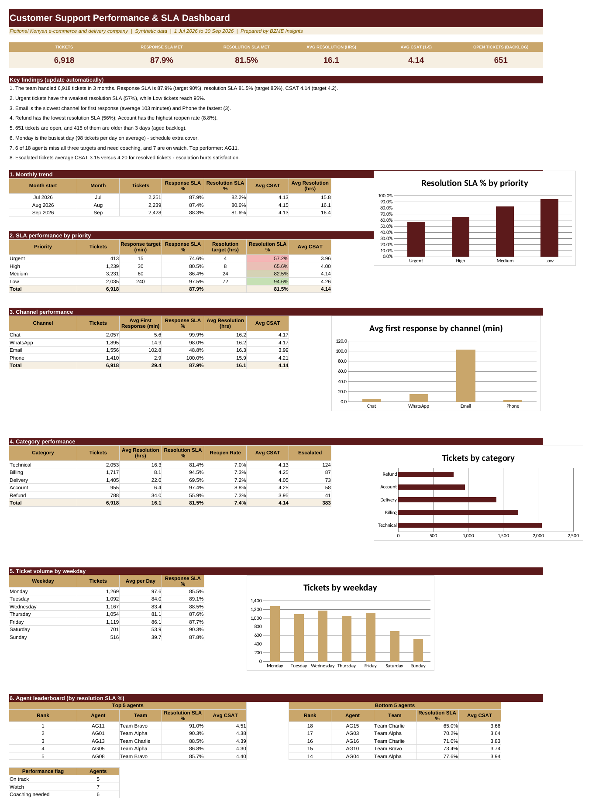

# Customer Support Performance & SLA
**Sector:** Operations / Support  |  **Tool:** Excel  |  **Data:** synthetic

> All data in this project is synthetic and generated for demonstration. Fee rates, targets and thresholds are illustrative.

## Dashboard preview

## Business question
Is the support centre meeting its service-level targets, where do delays and reopened tickets come from, and which agents need coaching?

## Data
6,918 tickets (Jul to Sep 2026) and 18 agents in 3 teams.

## What I built
- Response and resolution SLA flags by priority
- CSAT, reopen rate and aged backlog
- Channel, category and weekday views
- Agent scorecard with coaching flags

## Key results (from the workbook)
- Response SLA 87.9% (target 90%); resolution SLA 81.5% (target 85%); CSAT 4.14
- Urgent tickets have the weakest resolution SLA (57%); Refund is the slowest category
- Email averages about 103 minutes to first response vs about 3 on phone
- 415 open tickets are older than 3 days
- Escalated tickets average CSAT 3.15 vs 4.20 for resolved tickets

## Skills shown
Excel (COUNTIFS, AVERAGEIFS, INDEX/MATCH, WEEKDAY), SLA and KPI reporting, agent analytics

## Files
- [Customer_Support_SLA_Portfolio.xlsx](Customer_Support_SLA_Portfolio.xlsx): the Excel workbook (open it and change the **Assumptions** sheet to see the dashboard update)
- [docs/BZME_04_Customer_Support_SLA_Project_Guide.docx](docs/BZME_04_Customer_Support_SLA_Project_Guide.docx): project write-up explaining how it works

## How to explore
1. Download the workbook and open the **Dashboard** sheet.
2. Open **Assumptions**, change one value, and watch the dashboard update.
3. Click any dashboard number and trace it back through the calculation sheet to the raw data.

---
Built by Madikizelah (Maddie) Nduta | BZME Insights | [LinkedIn]([your LinkedIn URL])
